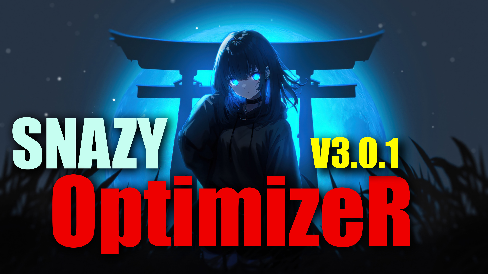

# SNAZY Optimizer

  

### SNAZY Optimizer V3.0.1

A lightweight Android gaming optimizer designed to improve gaming performance, reduce background load, and provide advanced gaming controls.

SNAZY focuses on optimizing the device around your game without modifying game files.

---

## V3.0.1

SNAZY Optimizer V3 introduces a redesigned Pro experience, improved optimization controls, gaming-focused features, and a cleaner modern interface.

### What's New

- New SNAZY Pro dashboard
- Pro license system
- 15 / 30 day Pro keys
- One-key-one-device licensing
- Sensitivity & control tweaks
- Real-time FPS counter support
- FPS Counter Overlay
- Active cooling while gaming
- Higher performance optimization
- Cooldown Mode
- Background Freeze
- Apps kept alive / exclusion list
- Graphics rendering backend selection
- OpenGL ES / Vulkan preference
- Improved Boost system
- Restore system
- Cleaner glass-style UI
- Improved animations and controls

---

## Gaming Optimization

SNAZY provides a dedicated Boost system designed to prepare your device for gaming.

### Boost

The Boost system can reduce unnecessary background activity and apply available optimization settings before gaming.

### Background Freeze

Freeze background applications while gaming to reduce unnecessary resource usage.

You can also keep selected applications alive using the exclusion list.

### Cooldown Mode

Cooldown Mode periodically reduces background load during longer gaming sessions.

It is designed to help manage device load without intentionally throttling the game itself.

---

## Pro Features

SNAZY Pro unlocks additional gaming optimization features.

### Sensitivity & Control Tweaks

Fine-tune available touch and control-related settings for supported games.

### Real-Time FPS Counter

Display live FPS information while gaming where supported by the device and Android environment.

### FPS Counter Overlay

Provides a floating FPS overlay for supported devices.

### Active Cooling

Provides thermal-aware optimization behaviour during gaming sessions.

### Higher Performance Ceiling

Applies a more aggressive optimization pass compared with the standard/free experience.

---

## Graphics Rendering Backend

SNAZY provides graphics API preferences:

- OpenGL ES
- Vulkan

These settings provide a preference to SNAZY/the game environment.

> Note: Android and the game itself must support the selected graphics API. SNAZY cannot force a game to support an API that it does not support.

---

## Pro License

SNAZY Pro uses a license-key system.

Supported license durations:

- 15 Days
- 30 Days

Each key is activated when first redeemed and is linked to the first device that redeems it.

The same device can restore its existing Pro status without restarting the license period.

---

## Privacy & Security

SNAZY does not modify game files as part of the normal Boost process.

The Pro license system uses Firebase services for license verification and device-based activation.

Service credentials and private administrative keys must never be included in the public source code or APK.

---

## Requirements

- Android 10 or newer
- Compatible Android device
- Some advanced features may require additional permissions or supported device capabilities

Feature availability may vary depending on Android version, manufacturer and device.

---

## Screenshots

### SNAZY Pro

### Gaming Optimization

---

## Disclaimer

SNAZY Optimizer does not guarantee a specific FPS increase.

Actual performance depends on:

- Device hardware
- Android version
- Thermal conditions
- Game engine
- Graphics settings
- Background applications
- Game and manufacturer limitations

SNAZY does not modify or provide game files.

---

## Developer

**sethikaDV**

SNAZY Optimizer

© 2026 sethikaDV
