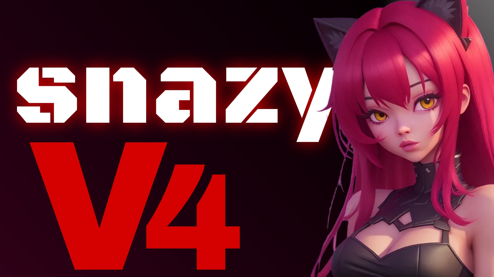

# 🚀 SNAZY Optimizer V4.2.8

  

### 🎮 The Ultimate In-Game Gaming Experience

**SNAZY Optimizer V4.2.8** brings a new level of gaming convenience with the all-new **In-Game Super Panel Turbo**. Access essential gaming tools, manage your device, control settings, and customize your gaming experience without leaving your game.

Built for gamers who want more control, better convenience, and a premium gaming interface. ⚡

---

## 🆕 What's New in V4.2.8

### 🎮 In-Game Super Panel Turbo

Your gaming tools, all in one place!

* ⚡ **Free Turbo Boost** — Quickly access available optimization features.
* 🎵 **In-Game Music Player** — Enjoy your favorite music while gaming.
* 📊 **In-Game Device Status** — Check supported device information during gameplay.
* ⏱️ **Gaming Timer** — Keep track of your gaming sessions.
* 🔕 **Do Not Disturb (DND)** — Reduce interruptions while playing.
* 🔋 **Bypass Charging** — Use supported charging-control features while gaming.
* 🎛️ **Control Settings** — Access available gaming controls quickly.
* 🎥 **Screen Recorder** — Access screen recording tools without leaving your game.
* 💎 **Premium UI** — Enjoy a refined, modern interface designed for gamers.

### ⚡ Free Turbo Boost

Get quick access to available performance optimization tools with Free Turbo Boost.

* Quick access to supported boost actions.
* Convenient in-game controls.
* Designed for a smoother gaming workflow.
* No need to navigate through multiple screens for supported actions.

*Actual results depend on your device, Android version, and available permissions.*

### 🎵 In-Game Music Player

Keep your favorite music close while gaming.

* Convenient music controls.
* Control your listening experience while playing.
* Enjoy your gaming sessions with your preferred soundtrack.

### 📊 In-Game Device Status

View supported device information while playing.

* Access useful device status information.
* Monitor available device indicators.
* Keep important information within reach.

The information available depends on device compatibility and granted permissions.

### ⏱️ Gaming Timer

Manage your gaming sessions with the built-in timer.

* Track session time.
* Access the timer from the Super Panel.
* Keep your gaming routine organized.

### 🔕 Gaming Do Not Disturb

Reduce unwanted interruptions during gameplay.

* Quickly access DND controls.
* Minimize distractions when supported.
* Stay focused on your game.

Some notification and DND controls may require additional Android permissions.

### 🔋 Bypass Charging

Access charging-control features designed for supported devices.

* Convenient in-game charging controls.
* Device-dependent charging functionality.
* Designed to help manage charging during gaming sessions.

**Important:** Bypass charging is not universally supported. Actual functionality depends on your phone's hardware, Android software, and available system-level access. The feature does not guarantee reduced heat or improved battery health.

### 🎛️ In-Game Control Settings

Quickly access supported controls through the Super Panel.

* Convenient control access.
* Less switching between app screens.
* A gaming-focused control experience.

### 🎥 Screen Recorder

Capture your gameplay using the available screen recording functionality.

* Quick access to recording controls.
* Record gameplay when supported.
* Useful for highlights, tutorials, and sharing gaming moments.

Android may require screen-capture permission before recording begins.

---

## 🎨 Previous Features — Still Part of the SNAZY Experience

### 🎨 Real-Time Game Color Changer

Customize your gaming visuals with supported color-changing options.

### 🎨 In-App Color Changer

Personalize the app's appearance to match your style.

### ⚡ Powerful Optimization Engine

Access supported optimization tools designed to help manage device resources during gaming.

### 🎮 Per-Game Display Optimization

Configure supported display settings for individual games.

* Available refresh-rate options.
* Per-game render-resolution settings.
* DPI scaling where supported.
* Boost and Restore workflows.
* Reset display settings when needed.

Display controls depend on device support and may require Root or Shizuku access.

### 🎯 Pro Sensitivity for Device

Explore game-specific sensitivity starting points based on your selected game and device information.

Supported game options may include:

* Free Fire
* Free Fire MAX
* PUBG Mobile
* BGMI
* Call of Duty: Mobile

Suggested values are starting points, not guaranteed optimal or professionally measured settings. Fine-tune them in the game's training mode.

### 🧊 Background App Management

Manage supported background-app actions to help reduce unnecessary activity during gaming.

Use caution when restricting apps that handle notifications, calls, alarms, or important background tasks.

### 💎 SNAZY Pro

Access supported premium features through the SNAZY Pro experience. Pro availability and individual features depend on the version and licensing status.

### 🔐 SNAZY Account System

Access the available account features, including Google Login where supported by the installed version.

### 🔋 Charging Optimization

Use available charging-related controls where supported by your device.

### 📊 Floating Status Overlay

Access supported floating device information and status indicators when the required permissions are granted.

### 🛠️ Smart Restore

Restore display or other settings that SNAZY has saved and can safely restore. Some system changes may need to be reverted manually.

---

## 🔑 Root & Shizuku Support

SNAZY provides supported features according to your device's access level.

* **Root:** Enables compatible advanced system controls.
* **Shizuku:** Enables supported privileged operations after the service and permissions are configured.
* **Non-root mode:** Provides features that can run without elevated system access.

Not every feature is available in every mode. Shizuku access may need to be reconnected after a reboot or service interruption.

---

## 🛡️ Compatibility & Important Notes

* Android compatibility depends on the feature and installed version.
* Some functions require additional permissions.
* Certain controls require Root, Shizuku, or manufacturer support.
* Screen recording is subject to Android's screen-capture permissions.
* Color changes and display controls may behave differently across devices.
* Charging controls cannot bypass hardware limitations.
* SNAZY does not guarantee a specific FPS increase or temperature reduction.
* Always use Restore or your device's normal settings if a display configuration causes problems.

---

## 📦 Version Information

* **App:** SNAZY Optimizer
* **Version:** V4.2.8
* **Developer:** [@sethikaDV](https://github.com/sethikaDV)
* **Repository:** [SNAZY Optimizer on GitHub](https://github.com/sethikaDV/Snazy-optimizer-)

---

## ❤️ Support the Project

If you enjoy using SNAZY Optimizer:

* ⭐ Star the GitHub repository.
* 🐛 Report bugs and compatibility issues.
* 💡 Share ideas for future improvements.
* 📢 Share SNAZY with fellow gamers.

---

### 🚀 SNAZY Optimizer V4.2.8

**Play Smarter. Control More. Game Your Way.** 🎮⚡

*Feature availability may vary by device, Android version, permissions, and access mode.*
